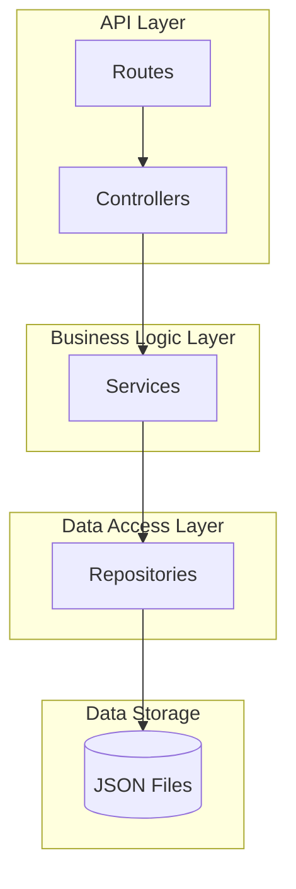
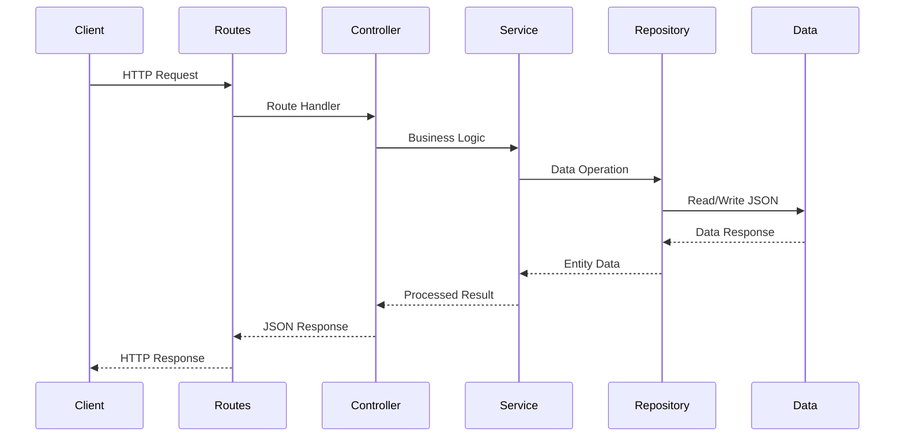
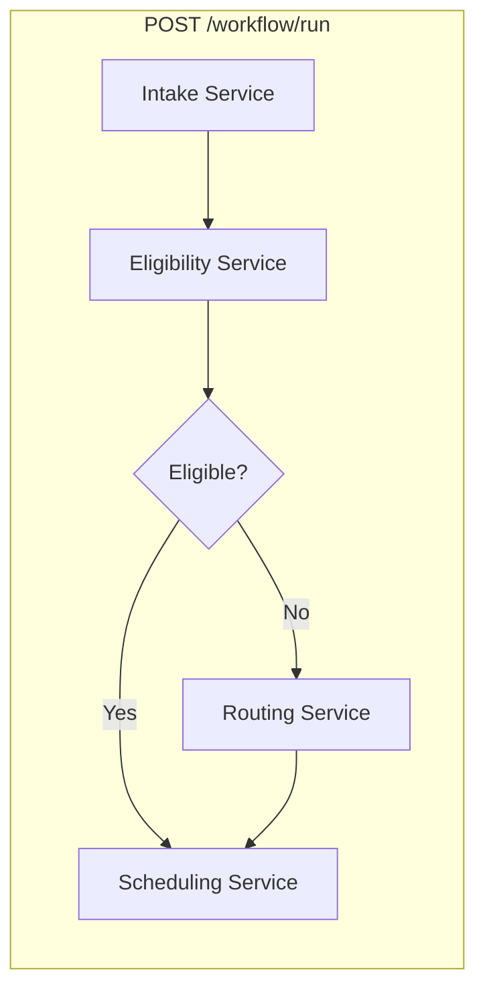
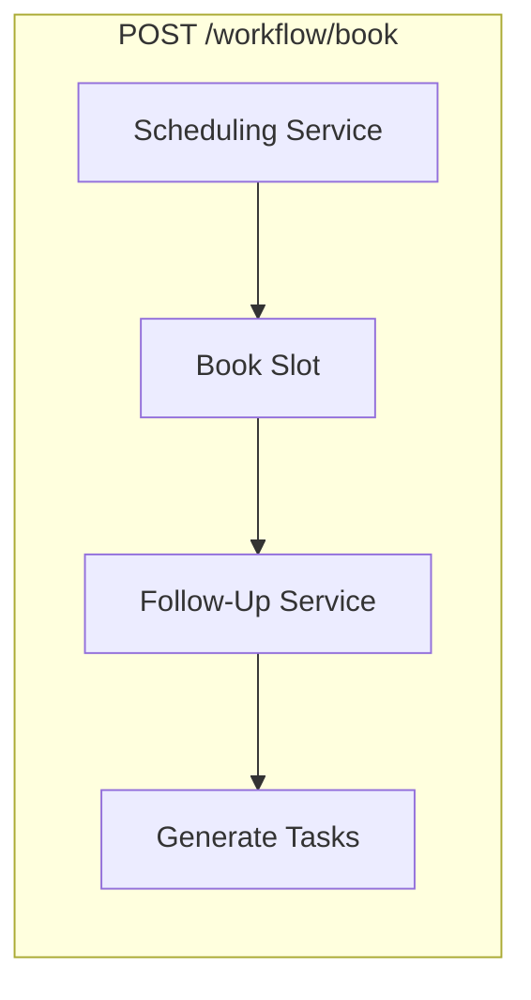

# BeamHealth Backend

A Node.js backend application for healthcare workflow management. This system handles patient intake, insurance eligibility verification, appointment scheduling, smart routing, and comprehensive invoice management.

## Table of Contents

- [Overview](#overview)
- [Architecture](#architecture)
- [Project Structure](#project-structure)
- [Getting Started](#getting-started)
  - [Prerequisites](#prerequisites)
  - [Installation](#installation)
  - [Running the Server](#running-the-server)
- [API Reference](#api-reference)
  - [Patients](#patients-api)
  - [Insurances](#insurances-api)
  - [Appointments](#appointments-api)
  - [Workflow](#workflow-api)
  - [Invoices](#invoices-api)
- [Data Models](#data-models)
- [Technologies Used](#technologies-used)

---

## Overview

This backend provides a RESTful API for managing healthcare workflows. Key features include:

- **Patient Intake**: Auto-fill patient information from existing records.
- **Insurance Eligibility**: Real-time eligibility checks with copay and denial reason information.
- **Smart Routing**: Alternative plan suggestions when insurance is denied.
- **Appointment Scheduling**: View available slots and book appointments.
- **Follow-Up Generation**: Automated post-visit task generation and reminders.
- **Invoice Management**: Full CRUD operations with filtering, statistics, and status tracking.

---

## Architecture

The project follows **Clean Architecture** principles with clear separation of concerns.

### Layer Structure



### Request Flow



### Workflow Orchestration

The workflow endpoints orchestrate multiple services to complete complex healthcare processes:





### Layer Responsibilities

| Layer | Description |
| :--- | :--- |
| Routes | Define HTTP endpoints and route requests to controllers. |
| Controllers | Handle request/response formatting and delegate to services. |
| Services | Contain core business logic and orchestrate workflows. |
| Repositories | Provide data access patterns and abstract data storage. |
| Models | Define data structures and entity schemas. |
| Utils | Shared helper functions for file I/O and formatting. |

---

## Project Structure

```
Backend/
├── package.json           # Project configuration and dependencies
├── README.md              # This file
│
└── src/
    ├── server.js          # Server entry point (starts on port 4000)
    ├── app.js             # Express application setup and middleware
    │
    ├── controllers/       # Request handlers
    │   ├── appointmentController.js
    │   ├── invoiceController.js
    │   ├── patientController.js
    │   └── workflowController.js
    │
    ├── services/          # Business logic layer
    │   ├── eligibilityService.js   # Insurance eligibility checks
    │   ├── followUpService.js      # Post-visit workflow generation
    │   ├── intakeService.js        # Patient intake auto-fill
    │   ├── invoiceService.js       # Invoice CRUD and filtering
    │   ├── routingService.js       # Denial routing alternatives
    │   └── schedulingService.js    # Appointment slot management
    │
    ├── repositories/      # Data access layer
    │   ├── appointmentRepository.js
    │   ├── insuranceRepository.js
    │   ├── invoiceRepository.js
    │   └── patientRepository.js
    │
    ├── routes/            # API route definitions
    │   ├── appointmentRoutes.js
    │   ├── insuranceRoutes.js
    │   ├── invoiceRoutes.js
    │   ├── patientRoutes.js
    │   └── workflowRoutes.js
    │
    ├── models/            # Entity class definitions
    │   ├── Appointment.js
    │   ├── Insurance.js
    │   ├── Invoice.js
    │   └── Patient.js
    │
    ├── data/              # JSON data storage (simulates database)
    │   ├── appointments.json
    │   ├── insurances.json
    │   ├── invoices.json
    │   └── patients.json
    │
    └── utils/             # Helper utilities
        ├── fileUtil.js    # JSON file read/write operations
        └── formatter.js   # Response formatting helpers
```

---

## Getting Started

### Prerequisites

- Node.js (v16 or higher)
- npm (Node Package Manager)

### Installation

1. Navigate to the Backend directory:

   ```bash
   cd Backend
   ```

2. Install dependencies:

   ```bash
   npm install
   ```

### Running the Server

**Development mode** (with hot reload via nodemon):

```bash
npm run dev
```

**Production mode**:

```bash
npm start
```

The server runs on **http://localhost:4000**.

---

## API Reference

### Patients API

Base URL: `/patients`

| Method | Endpoint | Description |
| :--- | :--- | :--- |
| GET | `/` | Retrieve all patients |
| GET | `/:id` | Retrieve a patient by ID |
| POST | `/` | Create a new patient |

**Create Patient Request Body:**

```json
{
  "first_name": "Jane",
  "last_name": "Doe",
  "dob": "1995-05-20",
  "email": "jane.doe@example.com",
  "phone": "555-0199",
  "gender": "F"
}
```

---

### Insurances API

Base URL: `/insurances`

| Method | Endpoint | Description |
| :--- | :--- | :--- |
| GET | `/` | List all insurance providers |
| GET | `/:id` | Get details of a specific provider |

---

### Appointments API

Base URL: `/appointments`

| Method | Endpoint | Description |
| :--- | :--- | :--- |
| GET | `/available` | Get all available (unbooked) appointment slots |

---

### Workflow API

Base URL: `/workflow`

These endpoints orchestrate complex multi-step healthcare processes.

#### Run Unified Flow

**Endpoint:** `POST /workflow/run`

Performs patient intake, checks eligibility, calculates routing options (if denied), and returns available appointment slots.

**Request:**

```json
{
  "patientId": 1,
  "insuranceId": 1
}
```

**Response:**

```json
{
  "intake": {
    "name": "John Smith",
    "dob": "1985-03-15",
    "email": "john.smith@email.com",
    "phone": "555-0101",
    "gender": "M"
  },
  "eligibility": {
    "eligible": true,
    "coPay": 25,
    "reason": null
  },
  "routing": null,
  "availableSlots": [...]
}
```

#### Book and Generate Follow-Up

**Endpoint:** `POST /workflow/book`

Books an appointment slot and generates post-visit follow-up tasks.

**Request:**

```json
{
  "appointmentId": 13,
  "patientId": 1,
  "insuranceId": 1
}
```

**Response:**

```json
{
  "bookedSlot": {
    "id": 13,
    "status": "booked",
    "start": "2025-12-10T09:00:00Z",
    "slot_duration": 30,
    "patient_id": 1
  },
  "followUp": {
    "confirmation": {...},
    "eligibilitySummary": {...},
    "reminder": {...},
    "postVisit": {...}
  }
}
```

---

### Invoices API

Base URL: `/invoices`

| Method | Endpoint | Description |
| :--- | :--- | :--- |
| GET | `/` | Get invoices with optional filters |
| GET | `/stats` | Get dashboard statistics |
| GET | `/:id` | Get a single invoice by ID |
| GET | `/patient/:patientId` | Get invoices for a specific patient |
| POST | `/` | Create a new invoice |
| PUT | `/:id` | Update an invoice |
| DELETE | `/:id` | Delete an invoice |

**Query Parameters for GET `/`:**

| Parameter | Description |
| :--- | :--- |
| status | Filter by status (draft, pending, submitted, paid, partial, denied, appealed) |
| claimType | Filter by claim type (medical, dental, vision) |
| search | Search by invoice number, patient name, or payer name |
| startDate | Filter by service date (from) |
| endDate | Filter by service date (to) |

---

## Data Models

### Patient

| Field | Type | Description |
| :--- | :--- | :--- |
| id | number | Unique identifier |
| first_name | string | Patient's first name |
| last_name | string | Patient's last name |
| dob | string | Date of birth (YYYY-MM-DD) |
| email | string | Email address |
| phone | string | Phone number |
| gender | string | Gender (M/F) |

### Insurance

| Field | Type | Description |
| :--- | :--- | :--- |
| id | number | Unique identifier |
| payer | string | Insurance company name |
| plan | string | Plan name |
| eligible | boolean | Eligibility status |
| coPay | number or null | Copay amount |
| reason | string or null | Denial reason |

### Appointment

| Field | Type | Description |
| :--- | :--- | :--- |
| id | number | Unique identifier |
| status | string | Status (available, booked) |
| start | string | Start time (ISO 8601) |
| slot_duration | number | Duration in minutes |
| patient_id | number or null | Assigned patient ID |

### Invoice

| Field | Type | Description |
| :--- | :--- | :--- |
| id | number | Unique identifier |
| invoiceNumber | string | Generated invoice number |
| patientId | number | Associated patient ID |
| patientName | string | Patient's full name |
| serviceDate | string | Date of service |
| dueDate | string | Payment due date |
| createdAt | string | Creation date |
| amount | number | Total invoice amount |
| balance | number | Remaining balance |
| paidAmount | number | Amount paid |
| status | string | Invoice status |
| claimType | string | Type of claim |
| payerName | string | Insurance payer name |
| payerId | number | Insurance payer ID |
| cptCodes | array | CPT procedure codes |
| icdCodes | array | ICD diagnosis codes |
| description | string | Service description |

---

## Technologies Used

| Technology | Purpose |
| :--- | :--- |
| Node.js | JavaScript runtime |
| Express.js | Web framework for REST API |
| fs-extra | Enhanced file system operations |
| CORS | Cross-origin resource sharing |
| Nodemon | Development auto-reload |

---