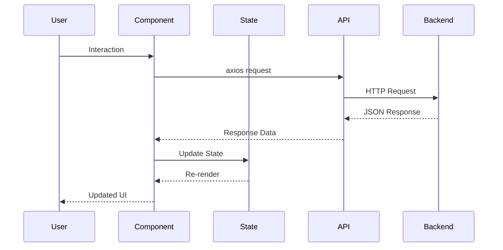
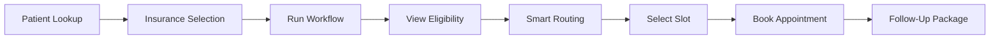
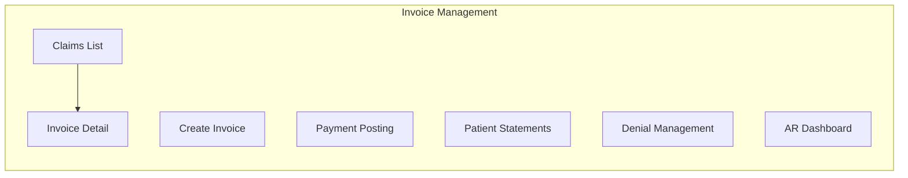

# BeamHealth Frontend

A React-based single-page application for healthcare workflow management. This frontend provides an intuitive interface for patient intake, insurance eligibility verification, appointment scheduling, and comprehensive invoice management.

## Table of Contents

- [Overview](#overview)
- [Architecture](#architecture)
- [Project Structure](#project-structure)
- [Getting Started](#getting-started)
  - [Prerequisites](#prerequisites)
  - [Installation](#installation)
  - [Running the Application](#running-the-application)
- [Application Routes](#application-routes)
- [Features](#features)
  - [Employee Workflow](#employee-workflow)
  - [Invoice Management](#invoice-management)
- [Components](#components)
- [API Integration](#api-integration)
- [Styling](#styling)
- [Technologies Used](#technologies-used)

---

## Overview

This frontend application provides a complete user interface for healthcare practice management. Key features include:

- **Landing Page**: Marketing page with feature overview and navigation.
- **Employee Workflow**: Multi-step patient intake with eligibility checking and appointment booking.
- **Invoice Management**: Full revenue cycle management with claims, payments, statements, and analytics.
- **Feature Pages**: Individual pages for AI-powered features (AI Intake, AI Scribe, AI Revenue, etc.).

---

## Architecture

The application follows a component-based architecture with clear separation between pages and reusable components.

### Data Flow



### Employee Workflow Flow



### Invoice Management Tabs



---

## Project Structure

```
Frontend/
├── index.html              # HTML entry point
├── package.json            # Project configuration and dependencies
├── vite.config.js          # Vite bundler configuration
│
└── src/
    ├── main.jsx            # React application entry with routing
    ├── App.jsx             # Employee Workflow page
    │
    ├── api/
    │   └── client.js       # Axios HTTP client configuration
    │
    ├── pages/
    │   ├── LandingPage.jsx       # Marketing landing page
    │   ├── AboutPage.jsx         # Company information page
    │   ├── InvoiceManagement.jsx # Invoice/RCM management page
    │   └── FeaturePage.jsx       # Feature pages (AI Intake, Scribe, Revenue, etc.)
    │
    ├── components/
    │   │
    │   │── [Workflow Components]
    │   ├── EmployeeLookupForm.jsx    # Patient search and creation
    │   ├── PatientSearch.jsx         # Autocomplete patient search
    │   ├── PatientSelector.jsx       # Patient dropdown selector
    │   ├── NewPatientForm.jsx        # New patient registration form
    │   ├── InsuranceSearch.jsx       # Insurance plan search
    │   ├── EligibilityPanel.jsx      # Eligibility status display
    │   ├── RoutingPanel.jsx          # Denial routing alternatives
    │   ├── SlotsList.jsx             # Available appointment slots
    │   ├── FollowUpPanel.jsx         # Post-booking follow-up display
    │   ├── IntakePanel.jsx           # Patient intake form display
    │   ├── WorkflowForm.jsx          # Workflow control form
    │   │
    │   │── [Invoice Components]
    │   ├── InvoiceNavTabs.jsx        # Tab navigation for invoice features
    │   ├── InvoiceStats.jsx          # Dashboard statistics cards
    │   ├── InvoiceFilters.jsx        # Search and filter controls
    │   ├── InvoiceList.jsx           # Claims/invoice table
    │   ├── InvoiceDetail.jsx         # Single invoice view
    │   ├── CreateInvoice.jsx         # New invoice creation form
    │   ├── ClaimSubmission.jsx       # Claim submission workflow
    │   ├── PaymentPosting.jsx        # Payment entry form
    │   ├── ERAImport.jsx             # Electronic remittance import
    │   ├── PatientStatements.jsx     # Patient billing statements
    │   ├── DenialManagement.jsx      # Denial tracking and appeals
    │   └── ARDashboard.jsx           # Accounts receivable analytics
    │
    └── styles/
        ├── App.css           # Main application styles
        └── Landing.css       # Landing page specific styles
```

---

## Getting Started

### Prerequisites

- Node.js (v16 or higher)
- npm (Node Package Manager)
- Backend server running on port 4000

### Installation

1. Navigate to the Frontend directory:

   ```bash
   cd Frontend
   ```

2. Install dependencies:

   ```bash
   npm install
   ```

### Running the Application

**Development mode** (with hot module replacement):

```bash
npm run dev
```

**Production build**:

```bash
npm run build
```

**Preview production build**:

```bash
npm run preview
```

The development server runs on **http://localhost:5173**.

---

## Application Routes

| Path | Component | Description |
| :--- | :--- | :--- |
| `/` | LandingPage | Marketing landing page with feature overview |
| `/about` | AboutPage | Company information and founder letter |
| `/workflow` | App | Employee intake and scheduling workflow |
| `/invoices` | InvoiceManagement | Complete invoice and RCM management |
| `/:agentId` | FeaturePage | Dynamic feature pages (ai-intake, ai-scribe, ai-revenue, etc.) |

---

## Features

### Employee Workflow

The Employee Workflow page (`/workflow`) guides users through a complete patient intake process:

| Step | Component | Description |
| :--- | :--- | :--- |
| 1 | EmployeeLookupForm | Search existing patients or create new ones |
| 2 | InsuranceSearch | Select insurance plan with eligibility preview |
| 3 | EligibilityPanel | View coverage status and copay information |
| 4 | RoutingPanel | See alternative options if insurance denied |
| 5 | SlotsList | Browse and select available appointment times |
| 6 | FollowUpPanel | View confirmation and automated follow-up tasks |

### Invoice Management

The Invoice Management page (`/invoices`) provides complete revenue cycle management:

| Tab | Component | Description |
| :--- | :--- | :--- |
| Claims List | InvoiceList | View, search, and filter all claims |
| Create Invoice | CreateInvoice | Generate new invoices with CPT/ICD codes |
| Payment Posting | PaymentPosting | Record payments and import ERA files |
| Statements | PatientStatements | Generate patient billing statements |
| Denials | DenialManagement | Track denied claims and manage appeals |
| Dashboard | ARDashboard | Aging buckets, status distribution, top payers |

---

## Components

### Workflow Components

| Component | Props | Description |
| :--- | :--- | :--- |
| EmployeeLookupForm | patients, onPatientSelected, onPatientCreated | Patient search with create option |
| PatientSearch | onPatientSelect | Autocomplete patient search input |
| InsuranceSearch | selectedInsurance, onSelect | Insurance plan selection with eligibility |
| EligibilityPanel | eligibility | Displays coverage status, copay, denial reason |
| RoutingPanel | routing | Shows alternative plans when denied |
| SlotsList | slots, selectedSlotId, onSelectSlot | Appointment slot selection |
| FollowUpPanel | followUp | Displays booking confirmation and tasks |

### Invoice Components

| Component | Props | Description |
| :--- | :--- | :--- |
| InvoiceNavTabs | activeTab, onTabChange | Tab navigation for invoice features |
| InvoiceStats | stats | Dashboard summary cards |
| InvoiceFilters | filters, onFilterChange | Search, status, date filtering |
| InvoiceList | invoices, loading, onInvoiceClick | Sortable claims table |
| InvoiceDetail | invoice, onBack, onDataChange | Single invoice view with actions |
| CreateInvoice | onInvoiceCreated | New invoice form with validation |
| PaymentPosting | invoices, onPaymentPosted | Payment entry with invoice lookup |
| ERAImport | invoices, onPaymentsPosted | Batch payment import |
| PatientStatements | invoices, patients | Generate and preview statements |
| DenialManagement | invoices, onDataChange | Denial tracking and appeal workflow |
| ARDashboard | invoices, stats | Analytics charts and metrics |

---

## API Integration

The frontend communicates with the backend via an Axios HTTP client.

### Configuration

```javascript
// src/api/client.js
import axios from "axios";

const api = axios.create({
  baseURL: import.meta.env.PROD 
    ? "https://beamhealth.onrender.com" 
    : "http://localhost:4000"
});

export default api;
```

### API Endpoints Used

| Endpoint | Method | Description |
| :--- | :--- | :--- |
| /patients | GET | Fetch all patients |
| /patients | POST | Create new patient |
| /insurances | GET | Fetch all insurance plans |
| /workflow/run | POST | Execute unified workflow |
| /workflow/book | POST | Book appointment and generate follow-up |
| /invoices | GET | Fetch invoices with filters |
| /invoices | POST | Create new invoice |
| /invoices/:id | PUT | Update invoice |
| /invoices/:id | DELETE | Delete invoice |
| /invoices/stats | GET | Fetch dashboard statistics |

---


## Technologies Used

| Technology | Purpose |
| :--- | :--- |
| React 18 | UI component library |
| React Router DOM | Client-side routing |
| Vite | Build tool and dev server |
| Axios | HTTP client for API calls |
| Heroicons | SVG icon library |
| CSS3 | Styling with modern features |

---
