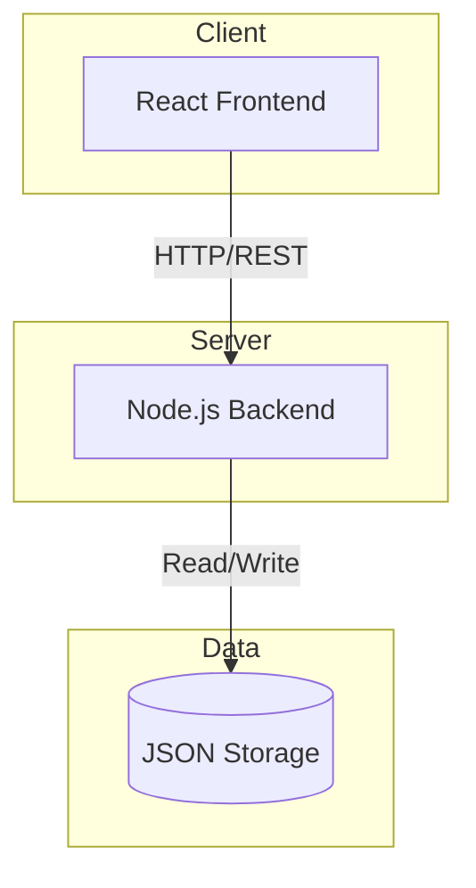
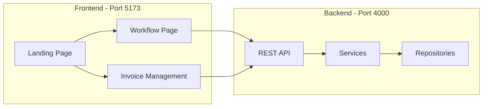
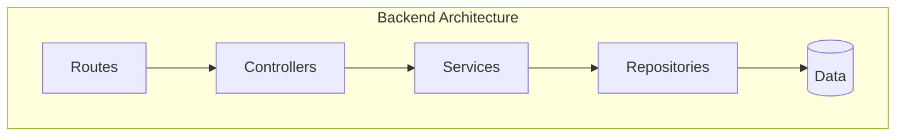

# BeamHealth

A full-stack healthcare workflow management application for patient intake, insurance eligibility verification, appointment scheduling, and comprehensive revenue cycle management.

## Table of Contents

- [Overview](#overview)
- [System Architecture](#system-architecture)
- [Tech Stack](#tech-stack)
- [Project Structure](#project-structure)
- [Getting Started](#getting-started)
  - [Prerequisites](#prerequisites)
  - [Quick Start](#quick-start)
  - [Manual Setup](#manual-setup)
- [Application Features](#application-features)
- [API Overview](#api-overview)
- [Documentation](#documentation)

---

## Overview

BeamHealth streamlines healthcare administrative workflows by providing:

- **Patient Intake** - Search existing patients or register new ones with automated form population
- **Insurance Eligibility** - Real-time verification of insurance coverage with copay information
- **Smart Routing** - Alternative plan suggestions when insurance is denied
- **Appointment Scheduling** - View available slots and book appointments
- **Follow-Up Management** - Automated post-visit task generation and reminders
- **Invoice Management** - Complete revenue cycle management with claims, payments, statements, denials, and analytics

---

## System Architecture

The application follows a client-server architecture with clear separation of concerns.

### High-Level Architecture



### Application Flow



### Clean Architecture Layers



---

## Tech Stack

| Layer | Technology | Purpose |
| :--- | :--- | :--- |
| Frontend | React 18 | UI component library |
| Frontend | Vite | Build tool and dev server |
| Frontend | React Router | Client-side routing |
| Frontend | Axios | HTTP client |
| Frontend | Heroicons | Icon library |
| Backend | Node.js | JavaScript runtime |
| Backend | Express.js | Web framework |
| Backend | fs-extra | File system operations |
| Backend | CORS | Cross-origin resource sharing |

---

## Project Structure

```
BeamHealth/
├── README.md                 # This file
├── start.sh                  # Unified startup script
│
├── Backend/                  # Node.js API Server
│   ├── README.md             # Backend documentation
│   ├── package.json
│   └── src/
│       ├── server.js         # Entry point
│       ├── app.js            # Express configuration
│       ├── controllers/      # Request handlers
│       ├── services/         # Business logic
│       ├── repositories/     # Data access
│       ├── models/           # Entity definitions
│       ├── routes/           # API endpoints
│       ├── data/             # JSON storage
│       └── utils/            # Helpers
│
└── Frontend/                 # React Application
    ├── README.md             # Frontend documentation
    ├── package.json
    ├── vite.config.js
    └── src/
        ├── main.jsx          # Entry with routing
        ├── App.jsx           # Workflow page
        ├── api/              # HTTP client
        ├── pages/            # Page components
        ├── components/       # Reusable components
        └── styles/           # CSS files
```

---

## Getting Started

### Prerequisites

- Node.js (v16 or higher)
- npm (Node Package Manager)
- Git

### Quick Start

The easiest way to run the application is using the provided startup script:

```bash
# Clone the repository
git clone https://github.com/Vikasumd/BeamHealth.git
cd BeamHealth

# Make the startup script executable (first time only)
chmod +x start.sh

# Start both services
./start.sh
```

The script will:
1. Check and install dependencies for both Backend and Frontend
2. Start the Backend server on port 4000
3. Start the Frontend dev server on port 5173
4. Display status information

Press `Ctrl+C` to stop all services.

### Manual Setup

If you prefer to run services separately:

**Terminal 1 - Backend:**

```bash
cd Backend
npm install
npm run dev
```

**Terminal 2 - Frontend:**

```bash
cd Frontend
npm install
npm run dev
```

### Access the Application

| Service | URL | Description |
| :--- | :--- | :--- |
| Frontend | http://localhost:5173 | React application |
| Backend API | http://localhost:4000 | REST API server |

---

## Application Features

### Landing Page

The marketing homepage provides navigation to all features and showcases the platform capabilities.

### Employee Workflow (`/workflow`)

A guided multi-step process for patient intake:

| Step | Description |
| :--- | :--- |
| 1. Patient Lookup | Search existing patients or create new ones |
| 2. Insurance Selection | Choose insurance plan with eligibility preview |
| 3. Eligibility Check | View coverage status and copay information |
| 4. Smart Routing | See alternatives if insurance is denied |
| 5. Slot Selection | Browse and select available appointment times |
| 6. Booking Confirmation | View confirmation and automated follow-up tasks |

### Invoice Management (`/invoices`)

Complete revenue cycle management:

| Tab | Description |
| :--- | :--- |
| Claims List | View, search, and filter all claims |
| Create Invoice | Generate new invoices with CPT/ICD codes |
| Payment Posting | Record payments and import ERA files |
| Patient Statements | Generate and preview billing statements |
| Denial Management | Track denied claims and manage appeals |
| AR Dashboard | Aging buckets, status distribution, analytics |

---

## API Overview

### Core Endpoints

| Method | Endpoint | Description |
| :--- | :--- | :--- |
| GET | /patients | List all patients |
| POST | /patients | Create new patient |
| GET | /insurances | List insurance plans |
| GET | /appointments/available | Get available slots |
| POST | /workflow/run | Execute intake workflow |
| POST | /workflow/book | Book appointment |
| GET | /invoices | List invoices with filters |
| POST | /invoices | Create new invoice |
| GET | /invoices/stats | Get dashboard statistics |

For complete API documentation, see [Backend README](./Backend/README.md).

---

## Documentation

Detailed documentation is available for each component:

| Document | Description |
| :--- | :--- |
| [Backend README](./Backend/README.md) | API reference, architecture details, data models |
| [Frontend README](./Frontend/README.md) | Component documentation, routing, styling guide |

---

## Scripts Reference

| Script | Location | Description |
| :--- | :--- | :--- |
| `./start.sh` | Root | Start both Backend and Frontend |
| `npm run dev` | Backend | Start backend with nodemon |
| `npm start` | Backend | Start backend in production mode |
| `npm run dev` | Frontend | Start Vite dev server |
| `npm run build` | Frontend | Build for production |
| `npm run preview` | Frontend | Preview production build |

---